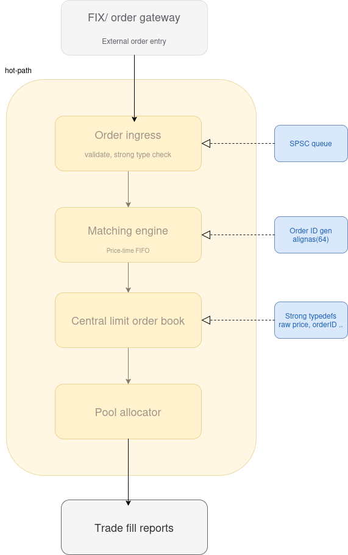

# Velocity Engine — Architecture Overview

## 1. Introduction

Velocity Engine is a low-latency, single-node matching engine designed to simulate the core components of a modern electronic trading system. The architecture prioritises **deterministic performance**, **cache efficiency**, and **clear separation of concerns**, inspired by real-world systems used in high-frequency trading environments.

The system follows a **pipeline-based design**, where each stage performs a well-defined responsibility and passes data downstream with minimal overhead.

---

## 2. High-Level Architecture



The system processes orders through the following stages:

```
FIX Gateway → Order Ingress → Matching Engine → Order Book → Memory Pool → Trade Reports
```

Each stage is designed to minimise latency, avoid unnecessary allocations, and maintain predictable execution.

---

## 3. Design Principles

### 3.1 Deterministic Latency

The system avoids unpredictable operations such as dynamic memory allocation and exceptions in the hot path. All critical components operate in constant or near-constant time.

### 3.2 Separation of Concerns

Each module is isolated:

* Input handling is separated from matching logic
* Memory management is abstracted away from core logic
* Validation occurs before entering performance-critical paths

### 3.3 Cache Efficiency

Data structures and memory layouts are designed to maximise cache locality and minimise cache line contention.

### 3.4 Lock-Free Communication

Where possible, inter-thread communication uses **Single Producer Single Consumer (SPSC)** queues to eliminate locking overhead.

---

## 4. Component Breakdown

### 4.1 FIX / Order Gateway

The gateway acts as the external interface for incoming orders. In production systems, this layer typically handles the FIX protocol, network I/O, and message parsing.

In this system:

* It converts external messages into internal representations
* It is intentionally decoupled from the matching engine to prevent I/O latency from affecting execution

---

### 4.2 Order Ingress

The Order Ingress layer is responsible for:

* Validating incoming orders (price, quantity, format)
* Enforcing strong typing for internal consistency
* Rejecting malformed or invalid orders early

Once validated, orders are passed to the matching engine via a **lock-free SPSC queue**, ensuring low-latency communication between producer and consumer threads.

---

### 4.3 Matching Engine

The matching engine is the core of the system. It processes incoming orders sequentially and applies **price-time priority (FIFO within price levels)**.

Responsibilities include:

* Matching incoming orders against existing liquidity
* Generating trade executions
* Maintaining deterministic execution order

To ensure performance:

* Order IDs are generated with cache-line alignment (`alignas(64)`) to avoid false sharing
* No dynamic allocation occurs in the hot path

---

### 4.4 Central Limit Order Book

The order book maintains the state of all active orders.

Key characteristics:

* Orders are organised by price level
* Each price level maintains FIFO ordering
* Strong typedefs (e.g., `Price`, `OrderId`) are used to prevent type-related bugs

Typical implementation:

* `std::map<Price, std::deque<Order>>` for ordered price levels
* Alternative structures (heaps + hash maps) may be explored for optimisation

---

### 4.5 Memory Pool Allocator

To eliminate the overhead of dynamic memory allocation:

* A custom pool allocator is used
* Memory is pre-allocated and reused

Benefits:

* Constant-time allocation and deallocation
* Reduced fragmentation
* Improved cache locality

This is critical for maintaining consistent latency in high-throughput scenarios.

---

### 4.6 Trade Fill Reports

After matching:

* Trade execution details are generated
* Reports are forwarded to downstream systems or clients

This stage is intentionally **decoupled from the hot path**, allowing asynchronous handling to avoid impacting matching latency.

---

## 5. Performance Considerations

### 5.1 Lock-Free Queues

The use of SPSC queues ensures:

* No mutex contention
* Predictable throughput
* Minimal synchronisation overhead

### 5.2 Cache Alignment

Critical structures are aligned to cache lines to:

* Avoid false sharing
* Improve memory access patterns

### 5.3 No Exceptions or RTTI

The system is compiled with:

* `-fno-exceptions`
* `-fno-rtti`

This reduces runtime overhead and improves predictability.

---

## 6. Future Extensions

Planned improvements include:

* Multi-threaded matching support
* Advanced order types (IOC, FOK)
* Market data feed replay tools
* Network gateway implementation (FIX/FAST)
* Risk management layer integration

---

## 7. Summary

Velocity Engine demonstrates a simplified but realistic trading system architecture, focusing on:

* Low-latency design
* Deterministic execution
* Clean modular structure

The system is intended as both a learning platform and a foundation for exploring advanced topics in high-performance systems and quantitative trading infrastructure.

---
